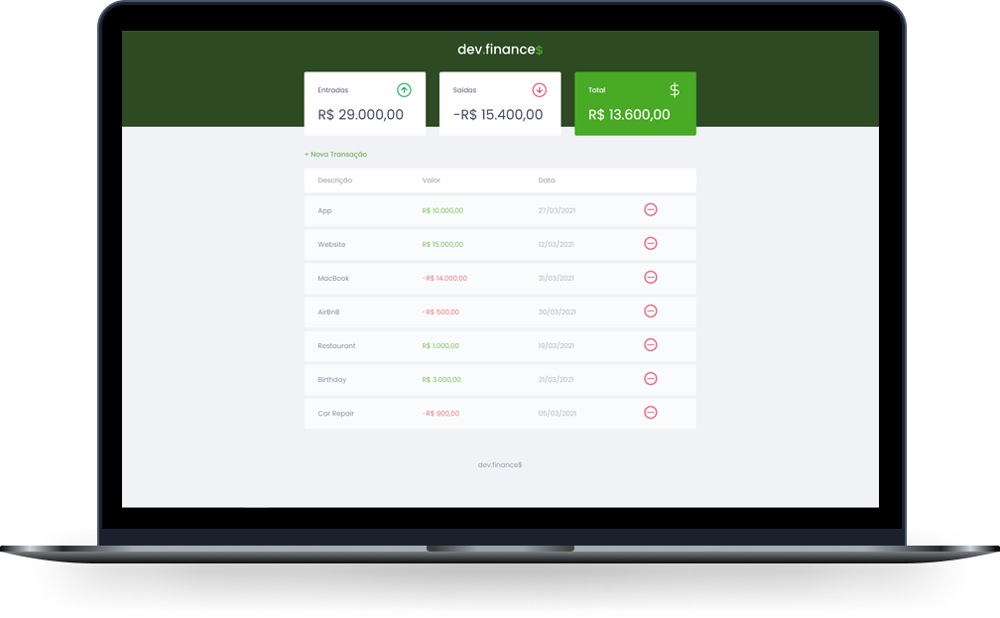

<h1 align="center">

</h1>

<a href="#-tecnologias">Tecnologias</a>   |   
<a href="#-projeto">Projeto</a>   |     
<a href="#-como-executar">Como executar</a>   |   
<a href="#-licença">Licença</a>

 

## ✨ Tecnologias

Esse projeto foi desenvolvido com as seguintes tecnologias:

- [JavaScript]
- [HTML5]
- [CSS3]

## 💻 Projeto

O dev.finance é uma aplicação desenvolvida com JavaScript para controle de ganhos e gastos através do navegador.

## 🚀 Como executar

- Clone o repositório
- Abrindo o index no navegador ou utilizando o Live Server do vscode já é possível visualizar e utilizar o projeto.

## 📄 Licença

Esse projeto está sob a licença MIT. Veja o arquivo [LICENSE](https://github.com/brener-js/move.it/blob/main/LICENSE.md) para mais detalhes.

---

Feito com ♥ by Brener 👋🏻
